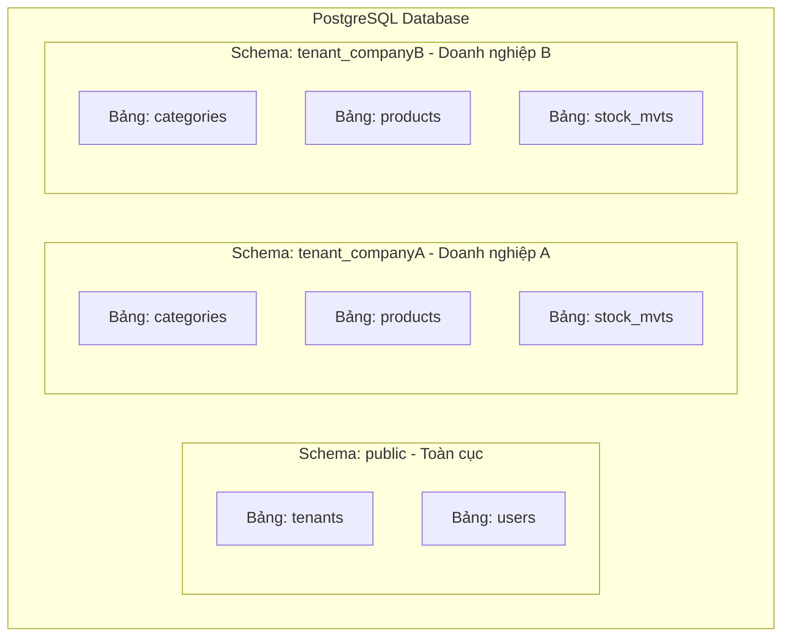

# SaaS Multi-Tenant Stock Management App (Hệ thống Quản lý Kho Đa Doanh nghiệp)

Dự án này là một ứng dụng **SaaS (Software as a Service) Quản lý Kho hàng đa doanh nghiệp** được xây dựng trên nền tảng **Spring Boot** (Java 21) và cơ sở dữ liệu **PostgreSQL**. Hệ thống áp dụng kiến trúc **Schema-based Multi-tenancy** (mỗi doanh nghiệp có một database schema biệt lập) để đảm bảo an toàn dữ liệu và tối ưu hóa tài nguyên.

---

## 🏗️ Kiến trúc Multi-Tenancy (Đa thuê bao)

Hệ thống sử dụng cơ chế **Schema-per-Tenant** kết hợp với một schema chung (`public`) để quản lý thông tin toàn cục.

### 1. Phân chia Cấu trúc Cơ sở Dữ liệu



*   **Schema `public` (Global):**
    *   **`tenants`:** Lưu trữ thông tin định danh của các doanh nghiệp đăng ký sử dụng dịch vụ (Tên công ty, mã code, trạng thái hoạt động).
    *   **`users`:** Danh sách toàn bộ tài khoản người dùng của hệ thống (bao gồm cả tài khoản của Super Admin và tài khoản nhân viên của từng doanh nghiệp). Các tài khoản được phân biệt với nhau qua cột liên kết `tenant_id`.
*   **Schema `tenant_<company_code>` (Isolated):**
    *   Mỗi doanh nghiệp khi được kích hoạt sẽ sở hữu riêng một PostgreSQL schema độc lập (ví dụ: `tenant_acme`, `tenant_vinamilk`).
    *   Các bảng nghiệp vụ kho hàng nằm hoàn toàn trong schema này, bao gồm: **`categories`** (Danh mục), **`products`** (Sản phẩm), và **`stock_mvts`** (Lịch sử nhập/xuất kho).

---

### 2. Nguyên lý Hoạt động & Định tuyến Tenant

Quy trình xử lý một request yêu cầu truy xuất dữ liệu doanh nghiệp diễn ra như sau:

```
[Client Request + JWT] 
      │
      ▼
[JwtAuthenticationFilter] ──► Giải mã JWT, lấy 'tenant_id'
      │
      ▼
[TenantContext] ───────────► Lưu tenant_id & schemaName vào ThreadLocal
      │
      ▼
[Hibernate Connection] ────► SET search_path TO tenant_<company_code>, public
```

1.  **JWT Authentication:** Client gửi request kèm JWT token ở Header. Bộ lọc [JwtAuthenticationFilter](file:///d:/PhamBaBac/saas-multi-tenant-app/src/main/java/com/bacpham/saas/security/JwtAuthenticationFilter.java) sẽ giải mã token để lấy thông tin `tenant_id`.
2.  **Schema Resolution:** 
    *   [TenantSchemaResolver](file:///d:/PhamBaBac/saas-multi-tenant-app/src/main/java/com/bacpham/saas/config/TenantSchemaResolver.java) truy vấn cơ sở dữ liệu để lấy mã `company_code` tương ứng với `tenant_id` từ schema `public` (kết quả truy vấn được lưu vào bộ nhớ đệm `ConcurrentMapCacheManager` thông qua `@Cacheable` để cải thiện hiệu năng).
    *   Tên schema tương ứng sẽ là: `tenant_` + `company_code` (viết thường).
3.  **ThreadLocal Context:** Tên schema và tenant_id được lưu trữ tạm thời trong [TenantContext](file:///d:/PhamBaBac/saas-multi-tenant-app/src/main/java/com/bacpham/saas/config/TenantContext.java) bằng `ThreadLocal`.
4.  **Connection Routing:** 
    *   Khi JPA cần thực thi truy vấn, [CurrentTenantIdentifierResolverImpl](file:///d:/PhamBaBac/saas-multi-tenant-app/src/main/java/com/bacpham/saas/config/CurrentTenantIdentifierResolverImpl.java) sẽ cung cấp schema hiện tại từ `TenantContext`.
    *   [MultiTenantConnectionProviderImpl](file:///d:/PhamBaBac/saas-multi-tenant-app/src/main/java/com/bacpham/saas/config/MultiTenantConnectionProviderImpl.java) thực hiện thiết lập cấu hình kết nối bằng câu lệnh:
        ```sql
        SET search_path TO tenant_<company_code>, public
        ```
    *   **Lưu ý:** Việc đưa `public` vào sau schema của tenant trong `search_path` giúp ứng dụng có thể vừa thực hiện CRUD các bảng nghiệp vụ của tenant vừa truy vấn được các bảng dùng chung (như `users`, `tenants`) nằm tại schema `public`.

---

## 🛠️ Dynamic Provisioning (Khởi tạo Schema Động)

Khi một doanh nghiệp đăng ký mới sử dụng hệ thống (`POST /api/v1/auth/register`), thông tin đăng ký được lưu lại dưới dạng trạng thái chờ phê duyệt (`PENDING`).

Khi Super Admin thực hiện phê duyệt doanh nghiệp (`POST /api/v1/tenants/approve/{tenant-id}`), quy trình tự động hóa (Provisioning) được khởi động:
1.  **Tạo Schema:** Sử dụng câu lệnh SQL:
    ```sql
    CREATE SCHEMA IF NOT EXISTS tenant_<company_code>
    ```
2.  **Flyway Migration:** Tạo một phiên bản Flyway động cấu hình riêng cho schema mới tạo để chạy các script DDL trong thư mục `db/migration/tenant` (ví dụ file [V1__init_tenant_schema.sql](file:///d:/PhamBaBac/saas-multi-tenant-app/src/main/resources/db/migration/tenant/V1__init_tenant_schema.sql)).
3.  **Khởi tạo Admin:** Tạo tài khoản quản trị doanh nghiệp (`COMPANY_ADMIN`) trong bảng `users` với liên kết đến `tenant_id` của doanh nghiệp mới được tạo.

---

## 💻 Công nghệ Sử dụng

*   **Ngôn ngữ & Framework:** Java 21, Spring Boot 4.0.6 (Spring Web MVC, Spring Security, Spring Data JPA, Validation).
*   **Cơ sở Dữ liệu & Di cư:** PostgreSQL 16+, Flyway.
*   **Bảo mật:** JWT (JSON Web Token), mã hóa mật khẩu BCrypt.
*   **Tiện ích:** Lombok, Springdoc OpenAPI 3.0 (Swagger UI), Caching.

---

## 🔑 Tài khoản Mặc định (Seed Data)

Khi ứng dụng khởi động lần đầu, một tài khoản **Platform Admin (Super Admin)** sẽ tự động được khởi tạo trong hệ thống để quản lý các tenant:

*   **Username:** `superadmin`
*   **Password:** `Admin@123`
*   **Role:** `ROLE_PLATFORM_ADMIN`
*   **Tenant:** `null` (Quản lý toàn bộ nền tảng SaaS)

---

## 📝 API Endpoints & Cấu trúc Dữ liệu (Request/Response)

Tất cả các API nghiệp vụ (ngoại trừ Auth) yêu cầu truyền Bearer JWT Token ở Header:
`Authorization: Bearer <access_token>`

---

### 1. Xác thực & Đăng ký (`/api/v1/auth`)

#### **Đăng ký doanh nghiệp mới**
*   **Method & Path:** `POST /api/v1/auth/register`
*   **Mô tả:** Đăng ký thông tin doanh nghiệp. Trạng thái sau khi đăng ký sẽ là `PENDING`.
*   **Request Body (`RegisterTenantRequest`):**
    ```json
    {
      "companyName": "Công ty Cổ phần Acme",
      "companyCode": "acme",
      "email": "contact@acme.com",
      "adminFullName": "Nguyễn Văn A",
      "adminEmail": "admin@acme.com",
      "adminUsername": "acmeadmin",
      "adminPassword": "Password123!"
    }
    ```
*   **Response:** `200 OK` (No Content)

#### **Đăng nhập hệ thống**
*   **Method & Path:** `POST /api/v1/auth/login`
*   **Mô tả:** Đăng nhập để nhận Token cho cả Platform Admin lẫn doanh nghiệp.
*   **Request Body (`LoginRequest`):**
    ```json
    {
      "username": "acmeadmin",
      "password": "Password123!"
    }
    ```
*   **Response Body (`LoginResponse`):**
    ```json
    {
      "accessToken": "eyJhbGciOiJSUzI1NiIsInR5cCI6IkpXVCJ9.eyJzdWIiOi...",
      "tokenType": "Bearer"
    }
    ```

---

### 2. Quản lý Tenant (`/api/v1/tenants`) - *Yêu cầu quyền Platform Admin*

#### **Danh sách tất cả Tenant (Phân trang)**
*   **Method & Path:** `GET /api/v1/tenants?page=0&size=10`
*   **Response Body (`PageResponse<TenantResponse>`):**
    ```json
    {
      "content": [
        {
          "tenantId": "c4d08b1a-2895-46aa-bd1a-7b3bbdf34aa2",
          "companyName": "Công ty Cổ phần Acme",
          "companyCode": "acme",
          "email": "contact@acme.com",
          "adminFullName": "Nguyễn Văn A",
          "adminEmail": "admin@acme.com",
          "adminUsername": "acmeadmin",
          "adminPassword": "{bcrypt}$2a$10$...",
          "createdAt": "2026-05-22T08:00:00",
          "status": "PENDING"
        }
      ],
      "page": 0,
      "size": 10,
      "totalElements": 1,
      "totalPages": 1,
      "hasNext": false,
      "hasPrevious": false,
      "isFirst": true,
      "isLast": true
    }
    ```

#### **Phê duyệt doanh nghiệp (Approve & Provision)**
*   **Method & Path:** `POST /api/v1/tenants/approve/{tenant-id}`
*   **Mô tả:** Phê duyệt tenant, tự động tạo schema `tenant_<companyCode>` và chạy các file di cư database Flyway.
*   **Response:** `200 OK`

#### **Kích hoạt / Khóa / Tạm dừng Tenant**
*   **Method & Path:**
    *   `PATCH /api/v1/tenants/activate/{tenant-id}` (Kích hoạt - `ACTIVE`)
    *   `PATCH /api/v1/tenants/deactivate/{tenant-id}` (Vô hiệu hóa - `INACTIVE`)
    *   `PATCH /api/v1/tenants/suspend/{tenant-id}` (Tạm ngưng - `SUSPENDED`)
*   **Response:** `200 OK`

---

### 3. Quản lý Thành viên (`/api/v1/users`) - *Yêu cầu quyền Company Admin*

#### **Tạo thành viên mới**
*   **Method & Path:** `POST /api/v1/users`
*   **Request Body (`UserRequest`):**
    ```json
    {
      "username": "nhanvien1",
      "email": "nhanvien1@acme.com",
      "password": "NhanVienPassword123!",
      "firstName": "Trần",
      "lastName": "Văn B",
      "role": "ROLE_USER" 
    }
    ```
    *(Các Role hợp lệ: `ROLE_COMPANY_ADMIN`, `ROLE_ADMINISTRATOR`, `ROLE_USER`, `ROLE_SALES_OPERATOR`)*
*   **Response:** `201 Created`

#### **Danh sách thành viên (Phân trang)**
*   **Method & Path:** `GET /api/v1/users?page=0&size=10`
*   **Response Body (`PageResponse<UserResponse>`):**
    ```json
    {
      "content": [
        {
          "id": "e5f09c1a-2895-46aa-bd1a-8c4ccdf34bb3",
          "username": "nhanvien1",
          "email": "nhanvien1@acme.com",
          "firstName": "Trần",
          "lastName": "Văn B",
          "role": "ROLE_USER"
        }
      ],
      "page": 0,
      "size": 10,
      "totalElements": 1,
      "totalPages": 1,
      "hasNext": false,
      "hasPrevious": false,
      "isFirst": true,
      "isLast": true
    }
    ```

#### **Xem chi tiết người dùng**
*   **Method & Path:** `GET /api/v1/users/{user-id}`
*   **Response Body (`UserResponse`):** (Cấu hình như đối tượng bên trong `content` ở trên).

#### **Cập nhật thông tin thành viên**
*   **Method & Path:** `PUT /api/v1/users/{user-id}`
*   **Request Body (`UserRequest`):** (Tương tự cấu trúc của POST)
*   **Response:** `202 Accepted`

#### **Bật / Tắt trạng thái hoạt động**
*   **Method & Path:**
    *   `PUT /api/v1/users/{user-id}/enable`
    *   `PUT /api/v1/users/{user-id}/disable`
*   **Response:** `202 Accepted`

#### **Xóa mềm người dùng**
*   **Method & Path:** `DELETE /api/v1/users/{user-id}`
*   **Mô tả:** Đánh dấu `deleted = true` của tài khoản để lưu vết.
*   **Response:** `204 No Content`

---

### 4. Quản lý Danh mục (`/api/v1/categories`) - *Môi trường Tenant*

#### **Tạo danh mục sản phẩm**
*   **Method & Path:** `POST /api/v1/categories`
*   **Request Body (`CategoryRequest`):**
    ```json
    {
      "name": "Điện tử & Điện lạnh",
      "description": "Các thiết bị gia dụng và đồ công nghệ"
    }
    ```
*   **Response:** `200 OK`

#### **Cập nhật danh mục**
*   **Method & Path:** `PUT /api/v1/categories/{category-id}`
*   **Request Body (`CategoryRequest`):** (Tương tự cấu trúc của POST)
*   **Response:** `202 Accepted`

#### **Xem danh sách danh mục (Phân trang)**
*   **Method & Path:** `GET /api/v1/categories?page=0&size=10`
*   **Response Body (`PageResponse<CategoryResponse>`):**
    ```json
    {
      "content": [
        {
          "id": "a1b2c3d4-5555-6666-7777-888888888888",
          "name": "Điện tử & Điện lạnh",
          "description": "Các thiết bị gia dụng và đồ công nghệ",
          "nbProducts": 12
        }
      ],
      "page": 0,
      "size": 10,
      "totalElements": 1,
      "totalPages": 1,
      "hasNext": false,
      "hasPrevious": false,
      "isFirst": true,
      "isLast": true
    }
    ```

---

### 5. Quản lý Sản phẩm (`/api/v1/products`) - *Môi trường Tenant*

#### **Tạo sản phẩm mới**
*   **Method & Path:** `POST /api/v1/products`
*   **Request Body (`ProductRequest`):**
    ```json
    {
      "name": "Laptop Asus Zenbook 14",
      "reference": "ASUS-ZB14-01",
      "description": "Intel Core Ultra 7, RAM 16GB, SSD 512GB",
      "alertThreshold": 5,
      "price": 24990000.00,
      "categoryId": "a1b2c3d4-5555-6666-7777-888888888888"
    }
    ```
*   **Response:** `200 OK`

#### **Cập nhật sản phẩm**
*   **Method & Path:** `PUT /api/v1/products/{product-id}`
*   **Request Body (`ProductRequest`):** (Tương tự cấu trúc của POST)
*   **Response:** `202 Accepted`

#### **Xem danh sách sản phẩm (Phân trang)**
*   **Method & Path:** `GET /api/v1/products?page=0&size=10`
*   **Response Body (`PageResponse<ProductResponse>`):**
    ```json
    {
      "content": [
        {
          "id": "p1q2r3s4-9999-8888-7777-666666666666",
          "name": "Laptop Asus Zenbook 14",
          "reference": "ASUS-ZB14-01",
          "description": "Intel Core Ultra 7, RAM 16GB, SSD 512GB",
          "alertThreshold": 5,
          "price": 24990000.00,
          "categoryId": "a1b2c3d4-5555-6666-7777-888888888888",
          "categoryName": "Điện tử & Điện lạnh",
          "availableQuantity": 42
        }
      ],
      "page": 0,
      "size": 10,
      "totalElements": 1,
      "totalPages": 1,
      "hasNext": false,
      "hasPrevious": false,
      "isFirst": true,
      "isLast": true
    }
    ```

---

### 6. Quản lý Biến động Kho (`/api/v1/stocks`) - *Môi trường Tenant*

#### **Tạo biến động kho (Nhập/Xuất)**
*   **Method & Path:** `POST /api/v1/stocks`
*   **Request Body (`StockMvtRequest`):**
    ```json
    {
      "typeMvt": "IN",
      "quantity": 10,
      "dateMvt": "2026-05-22",
      "comment": "Nhập thêm hàng từ nhà phân phối Asus VN",
      "productId": "p1q2r3s4-9999-8888-7777-666666666666"
    }
    ```
    *(Các `typeMvt` hợp lệ: `IN` (Nhập), `OUT` (Xuất))*
*   **Response:** `200 OK`

#### **Xem chi tiết lịch sử biến động**
*   **Method & Path:** `GET /api/v1/stocks/{stock-mvt-id}`
*   **Response Body (`StockMvtResponse`):**
    ```json
    {
      "id": "m1n2o3p4-0000-1111-2222-333333333333",
      "typeMvt": "IN",
      "quantity": 10,
      "dateMvt": "2026-05-22",
      "comment": "Nhập thêm hàng từ nhà phân phối Asus VN",
      "productName": "Laptop Asus Zenbook 14"
    }
    ```

#### **Danh sách biến động kho của sản phẩm cụ thể (Phân trang)**
*   **Method & Path:** `GET /api/v1/stocks/product/{product-id}?page=0&size=10`
*   **Response Body (`PageResponse<StockMvtResponse>`):** (Cấu hình tương tự các danh sách phân trang phía trên).

---

## 🚀 Hướng dẫn Cài đặt & Chạy ứng dụng

### 1. Chuẩn bị Môi trường
*   Cài đặt **Java Development Kit (JDK) 21**.
*   Cài đặt cơ sở dữ liệu **PostgreSQL** và tạo một database trống tên là `saas-app-db`.
*   Cài đặt công cụ **OpenSSL** (để tạo cặp khóa ký token JWT nếu cần thay đổi khóa mặc định).

### 2. Cấu hình Biến Môi trường (`.env`)
Tạo một file `.env` tại thư mục gốc của dự án (hoặc cập nhật file hiện tại) với nội dung phù hợp:

```properties
SPRING_PROFILES_ACTIVE=dev

# Cấu hình Kết nối CSDL PostgreSQL
DB_HOST=localhost
DB_PORT=5432
DB_NAME=saas-app-db
DB_USERNAME=postgres
DB_PASSWORD=your_db_password

# Cấu hình Cổng chạy Backend
SERVER_PORT=8080

# Cấu hình Đường dẫn Chứng chỉ JWT (Khóa ký SHA256)
JWT_PRIVATE_KEY_PATH=certs/private_key.pem
JWT_PUBLIC_KEY_PATH=certs/public_key.pem
JWT_ACCESS_TOKEN_EXPIRATION=86400000 # 24 giờ (đơn vị: mili-giây)
```

> **Mẹo tạo mới cặp khóa JWT:**
> Để sinh mới hoặc thay đổi cặp chứng chỉ JWT nằm trong [src/main/resources/certs](file:///d:/PhamBaBac/saas-multi-tenant-app/src/main/resources/certs):
> ```bash
> # Sinh khóa riêng tư (Private Key) định dạng PKCS8
> openssl genpkey -algorithm RSA -out private_key.pem -pkeyopt rsa_keygen_bits:2048
> 
> # Trích xuất khóa công khai (Public Key) tương ứng
> openssl rsa -pubout -in private_key.pem -out public_key.pem
> ```

### 3. Build và Khởi chạy Ứng dụng
Chạy các câu lệnh sau tại thư mục gốc dự án:

*   **Cách 1: Chạy bằng Maven Wrapper**
    ```bash
    ./mvnw spring-boot:run
    ```
*   **Cách 2: Build file JAR và chạy**
    ```bash
    ./mvnw clean package -DskipTests
    java -jar target/saas-multi-tenant-app-0.0.1-SNAPSHOT.jar
    ```

Sau khi ứng dụng khởi chạy thành công:
*   Bảng hệ thống của schema `public` (`tenants`, `users`) sẽ tự động được Hibernate tạo/cập nhật thông qua thiết lập `spring.jpa.hibernate.ddl-auto: update`.
*   Tài khoản admin mặc định `superadmin / Admin@123` được tạo sẵn.

### 4. Kiểm thử với Swagger UI
Mở trình duyệt và truy cập:
*   **Swagger API UI:** [http://localhost:8080/swagger-ui.html](http://localhost:8080/swagger-ui.html)
*   **OpenAPI OpenAPI JSON:** [http://localhost:8080/v3/api-docs](http://localhost:8080/v3/api-docs)

---

## 🛠️ Tài liệu Khắc phục sự cố & Lịch sử
Để biết thêm chi tiết về cách khắc phục các lỗi có thể xảy ra trong luồng Spring Security hoặc cấu hình AOP proxy dẫn đến `StackOverflowError` trong các phiên bản trước đó, vui lòng tham khảo tài liệu chi tiết tại [STACKOVERFLOWERROR_FIX.md](file:///d:/PhamBaBac/saas-multi-tenant-app/STACKOVERFLOWERROR_FIX.md).
